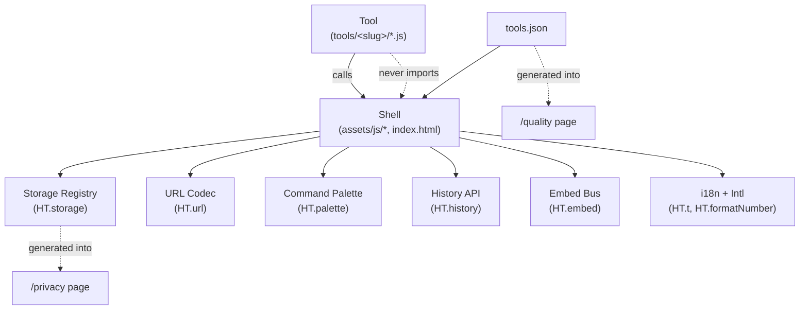
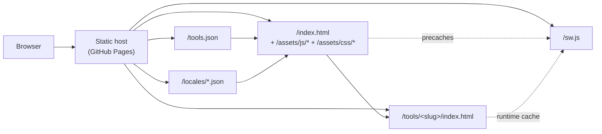

# Architecture Spine — Handy Tools

## Design Paradigm

**Shell-and-Tool with Embedded Modules.** The site is one persistent **Shell** (header, footer, command palette, settings modal, theme, locale, install prompt) that hosts independent **Tools**, each a self-contained folder (`tools/<slug>/`) that mounts into the Shell via a contract. Tools never reach into the Shell; the Shell never reaches into a Tool. A **Pack** is a presentation surface (a route + a grid filter on Site Data) — not a runtime boundary. **Embed mode** is a Tool rendered in the Shell with a flag set, not a separate product.

The smallest, most durable thing in this paradigm is the **Tool Contract**: a Tool ships an HTML/CSS/JS unit that knows how to read inputs (URL hash or DOM), render results (DOM), persist history (a single API), and tear down (one function call). Everything else — packs, embedding, dashboard, PWA — is composition on top of a Tool.

Namespace / directory map:

```
/                  → Shell (root index)
/packs/<slug>      → Pack page (Shell + filtered Site Data)
/embed/<slug>      → Embed route (Shell in embed mode + single Tool)
/quality           → Trust surface: quality scorecard
/privacy           → Trust surface: privacy claim
/tools/<slug>/     → Tool runtime (single Tool page)
/assets/js/        → Shell modules (HT.*)
/assets/css/       → Shell styles
/locales/<lng>.json → Message catalogs
/manifest.webmanifest, /sw.js → PWA
```

## Invariants & Rules

### AD-1 — Zero runtime third-party libraries

- **Binds:** `all` (every Tool, the Shell, the service worker)
- **Prevents:** a future contributor copy-pasting a CDN tag, npm install, or vendoring a runtime dep into the Shell
- **Rule:** No `<script src>` or `<link href>` may point to an external host. No `import` statement may resolve at runtime to anything outside the repo. Vendored libraries (e.g., `assets/js/qrcode.js`) are allowed only inside `assets/js/vendor/` and must be a single static file. `[ADOPTED from PRD §1 + UX §1.1]`

### AD-2 — Tool Contract is the unit of inclusion

- **Binds:** FR-1, FR-2, FR-3, FR-20
- **Prevents:** a Tool shipping with partial quality (e.g., mobile-broken, no history, no URL state) and quietly diluting the suite bar
- **Rule:** A Tool is "ready" iff `tools.json` records `score ≥ 8` and zero `waivers` expired (per FR-2). `ready=false` Tools do not appear in home grid, palette, pack pages, search, or embed catalog. CI rejects PRs that flip `ready` without a paired audit-doc update. `[ADOPTED from PRD §4.1]`

### AD-3 — Site Data is the single source of truth for discovery

- **Binds:** FR-4, FR-5, FR-6, FR-7, FR-20
- **Prevents:** the home grid, the command palette, pack pages, and the embed catalog drifting from each other or from the actual Tool folders
- **Rule:** Home grid, command palette results, pack pages, and embed catalog are all generated from `tools.json`. Adding a Tool requires only an entry in `tools.json` (and the folder). No HTML duplication. CI validates `tools.json` against the schema and asserts every `slug` resolves to `tools/<slug>/index.html`. `[ADOPTED from PRD §4.2]`

### AD-4 — Shell owns global concerns; Tools own local concerns

- **Binds:** FR-7, FR-8, FR-9, FR-12, FR-13, FR-17, FR-18, FR-19
- **Prevents:** two Tools independently implementing theme, locale, history, settings, or toast conventions and producing subtly incompatible UX
- **Rule:** Theme, locale, settings modal, command palette, toast region, install prompt, offline banner, history API, and data export/import are exclusively in the Shell (`assets/js/`). A Tool calls `HT.toast()`, `HT.history.push(slug, entry)`, `HT.formatNumber()`, `HT.t(key)` — it never re-implements them. The Tool folder ships only its own `index.html`, `<slug>.js`, `<slug>.css`. `[ADOPTED from PRD §4.3, §4.5 + UX §1.1]`

### AD-5 — URL is canonical state

- **Binds:** FR-5, FR-7, FR-10, FR-11, FR-21 (Tool Contract criterion 4)
- **Prevents:** two Tools choosing incompatible state-encoding schemes (e.g., one uses hash, one uses query) so a shared link breaks across tools; or a Tool and a pack link disagreeing about the same input
- **Rule:** Every Tool encodes its inputs into the URL on change (debounced). **Codec grammar** (binding for `HT.url.encode/decode`):
  - **Shell scope** uses the query string: `?tool=<slug>`, `?pack=<slug>`, `?embed=<slug>`, `?dashboard=1`, `?quality`, `?privacy` — the Shell owns these keys exclusively.
  - **Per-Tool scope** uses the fragment: `#k=v&k=v` — flat key/value pairs only, no nested objects at the URL level.
  - **Encoding:** UTF-8 percent-encoded. Keys are `[a-z][a-z0-9-]*` (kebab-case, lowercase). Values are scalar strings; arrays use `k=a&k=b` (duplicate-key form); numbers and dates serialize as their canonical string form (ISO-8601 for dates).
  - **Ordering:** keys are sorted lexicographically before encoding (deterministic canonical URL).
  - **Defaults:** omitted from the URL. A `HT.url.decode(tool, hash)` returns the parsed input merged with the Tool's declared defaults.
  - **Errors:** unknown keys are ignored silently; malformed values throw a typed error caught by the Tool's input handler and surfaced inline.
  - **Schema:** each Tool declares its URL schema in `tools.json` under `urlState: { key: { type, default, validators[] } }`. `HT.url.encode` / `HT.url.decode` validate against the schema; a missing schema entry is a build error.
  - **Versioning:** a `_v` key (when present) carries the schema version to allow graceful migration of older links.
  - **Pack defaults:** pack pages may set Tool defaults via `?tool=<slug>&defaults=<base64-encoded-json>`; the Shell merges pack defaults under the Tool's explicit fragment state, with explicit fragment state always winning. `[ADOPTED from PRD §4.1 criterion 4 + §4.4 + UX §1.4]`

### AD-6 — History and preferences are local-only, namespaced

- **Binds:** FR-12, FR-13, FR-15
- **Prevents:** a contributor reading or writing `localStorage` with a bare key and colliding with another Tool, or shipping a key that isn't listed on `/privacy`; two modules claiming ownership of the same key with incompatible schemas
- **Rule:** Every `localStorage` key is registered in a single `assets/js/storage-registry.js` as `HT.storage.register('namespace.key', { purpose, lifetime, schema, owner })`. The registry rejects duplicate registrations at boot. A Tool/Shell calls only `HT.storage.get/set/del` with a registered key. **Ownership**: each registered key has exactly one `owner` module. Other modules read/write through the owner's public API (e.g., `HT.history.push` for the per-tool history key), never through `HT.storage.set` directly on a non-owned key. Two namespaces: `ht.*` for runtime state (theme, locale, settings), `handy-tools.*` for user data (history, favorites, dashboard pins). The Shell owns the shared keys (`handy-tools.history.<slug>`, `handy-tools.favorites`, `handy-tools.dashboard`, `handy-tools.settings`); Tools own only their own history keys and read shared keys through `HT.*` APIs. The existing `ht.theme` key moves into the registry as `ht.theme` owned by `theme.js`. `[ASSUMPTION: existing 'ht.theme' is grandfathered into the registry without a migration step; we treat its absence as 'auto'.]`

### AD-7 — Embed mode is a Shell flag, not a separate app

- **Binds:** FR-10, FR-11
- **Prevents:** a fork of every Tool that supports `?embed=1` independently, producing inconsistent chrome-stripping or `postMessage` behavior across tools; one embed listening to another's messages; malformed payloads corrupting internal state
- **Rule:** `?embed=1` and `?embed=<slug>` both run the Shell in embed mode: header/footer hidden, palette disabled, settings disabled, history disabled, theme locked to system, locale locked to host locale if specified. The Tool itself does not know whether it is embedded; it renders identically. `postMessage` is implemented once in `assets/js/embed.js` and is the only channel between host and Tool. **Protocol contract**:
  - **Instance identity:** each embed instance gets a UUID assigned at boot; `HT.embed` is **instance-scoped**, not a single global registration. Multiple embeds on one host page do not see one another's messages.
  - **Envelope:** every message is `{ v: 1, id, type, payload? }` where `v` is the protocol version. Messages with mismatched `v` are ignored.
  - **Allowlist:** only these `type` values are recognized: `set-state`, `get-state` (request/response), `subscribe`, `unsubscribe`, `event` (tool → host), `ready`. Anything else is a no-op.
  - **Validation:** payload is JSON-validated against the per-type schema; oversized payloads (> 64 KB) are rejected; deeply nested values (> 8 levels) are rejected.
  - **Origin:** the guest validates `event.origin` against the host's allowed-origins list (default: `*` in dev, host-page origin in prod); the host validates `event.source` against the iframe's `contentWindow`.
  - **Teardown:** the iframe's `message` listener and any subscriptions are removed on `pagehide` / `unload` / explicit `destroy`.
  - **Versioning:** protocol version is bumped on breaking changes; old and new may coexist for one release. `[ADOPTED from PRD §4.4]`

### AD-8 — PWA service worker caches the Shell and per-Tool assets explicitly

- **Binds:** FR-14, FR-21 (Tool Contract criterion 3)
- **Prevents:** a Tool silently fetching a CDN at runtime and breaking the offline claim; cache stampede on shell upgrade; version skew between Shell, manifest, and Tools
- **Rule:** The service worker (`/sw.js`) precaches the Shell assets (`index.html`, `/assets/js/*`, `/assets/css/*`, `/locales/en.json`, `/manifest.webmanifest`, root icons) on install. Each Tool's `tools/<slug>/index.html` + matching CSS + JS is added to the runtime cache on first visit (stale-while-revalidate) and evicted by LRU when the cache exceeds a budget `[ASSUMPTION: budget = 8 MB or 50 Tools, whichever is smaller]`.
  - **Release identity:** one immutable cache-version string `CACHE_VERSION` lives at the top of `sw.js` and is updated atomically with every Shell, manifest, locale, or Tool-contract change. The `CACHE_VERSION` is also mirrored in `tools.json` under `releaseVersion`; CI rejects any PR where the two diverge.
  - **Lifecycle:** on `install`, the SW precaches the new Shell assets. On `activate`, old caches (any name not equal to current `CACHE_VERSION`) are deleted. `skipWaiting()` is enabled so the new SW activates immediately after install; clients are notified via `clients.claim()`.
  - **Navigation:** navigation requests fall back to `index.html` for SPA-style route handling (only the routes `/`, `/packs/*`, `/quality`, `/privacy`, `/embed/*`, `/tools/<slug>` — every other route returns the offline fallback).
  - **Compatibility:** a Tool is not advertised as `ready=true` until its assets are present in the active service worker's caching strategy and validate against the active `CACHE_VERSION`.
  - **PWA install:** triggered via `beforeinstallprompt` (Chromium only). On Safari (iOS + macOS), the Shell surfaces a manual instruction sheet ("Share → Add to Home Screen"). On Firefox desktop, the install button is hidden.
  - **Performance log caveat:** `performance.getEntriesByType('resource')` (used by AD-11) only shows resources loaded since the current navigation; cross-origin resources without Timing-Allow-Origin are reported with zeroed fields. This is sufficient for the "verifiable" claim because AD-1 forbids external hosts — all same-origin resources report real data. `[ADOPTED from PRD §4.6; budget value is an assumption pending post-MVP device testing.]`

### AD-9 — Tool-to-Tool composition only through Site Data and the Shell

- **Binds:** FR-6, FR-7, FR-20, FR-21
- **Prevents:** two Tools sharing a hidden private API, creating a coupling invisible to a third Tool author
- **Rule:** A Tool may not import another Tool's JS, read another Tool's DOM, or write to another Tool's `localStorage` namespace. Cross-Tool interaction happens only via the Shell: a Tool raises an event through `HT.actions.run('tool-id', { input })`, the Shell resolves the Tool via Site Data, and the receiving Tool's standard input contract is invoked. Pack pages are the only allowed grouping surface. `[ADOPTED from PRD §4.2 + §4.8]`

### AD-10 — Message catalogs and locale-aware formatting use `Intl.*` only

- **Binds:** FR-17, FR-18, FR-19
- **Prevents:** shipping per-locale date/number polyfills, regressing the bundle budget, or drifting between message catalogs and formatting
- **Rule:** All user-facing copy is keyed in `/locales/<lng>.json`. All formatting uses `Intl.NumberFormat`, `Intl.DateTimeFormat`, `Intl.PluralRules`, and `Intl.ListFormat`. No locale data is shipped; the runtime provides it. RTL is honored at the layout level via `[dir="rtl"]` toggling; the Shell's CSS is RTL-safe (logical properties: `margin-inline-start`, `padding-block-end`) and Tools must follow. `[ADOPTED from PRD §4.7]`

### AD-11 — Trust surface is generated, not authored

- **Binds:** FR-15, FR-16
- **Prevents:** the `/privacy` page drifting from the actual `localStorage` keys the site uses; the `/quality` page drifting from `tools.json`
- **Rule:** `/privacy` is generated from `assets/js/storage-registry.js` (AD-6) on every page load. `/quality` is generated from `tools.json` (AD-3) on every page load. The "View source" link on each Tool's footer uses the convention `https://github.com/<owner>/<repo>/blob/main/tools/<slug>/index.html`; the owner/repo comes from a single `assets/js/site-config.js` config object. Network log is captured via a `performance.getEntriesByType('resource')` snapshot rendered by `/privacy`. `[ADOPTED from PRD §4.6]`

### AD-12 — No SSR, no backend, no build step

- **Binds:** `all`
- **Prevents:** the introduction of a Node toolchain, a bundler, a server runtime, or any CI dependency that would re-add the "works offline" risk surface
- **Rule:** Every file in the repo is served as-is by the static host. There is no `package.json` build step, no transpiler, no TypeScript, no JSX. CSS is plain CSS with custom properties. JS is **ES5 baseline today** (matches existing `assets/js/utils.js`, `layout.js`, `theme.js`); new Shell modules may use ES2018 features (const, let, arrow, template literals) but **shall not rely on them in old modules** until those are migrated. Vendored libraries must be ES5/ES2018 source — no `.min.js` without the source also present in the repo. `[ADOPTED from PRD §1 + brownfield scan: no `package.json`, no `dist/`, no `node_modules/`.]`

### AD-13 — Dependency direction is one-way, Shell → Tool

- **Binds:** `all`
- **Prevents:** cyclic or sideways imports, a Tool inadvertently being loaded by the Shell at startup (slowing the home page), or a Tool reaching into the Shell's private DOM
- **Rule:** A Tool may not import another Tool's JS, may not DOM-query the Shell's internals, and may not reference the Shell's private symbols. A Tool may call only `HT.*` public methods. The Shell loads Tools on demand via dynamic `<script>` insertion after first paint (per AD-12 the bundler-free `import()` is replaced with `document.createElement('script')`). A Tool file declares its mount via `window.HT.register(slug, { mount, unmount })` and the Shell calls it.



A Tool calls only `HT.*` public methods. A Tool never imports, references, or DOM-queries the Shell's internals. The Shell loads Tools only on demand (lazy `<script>` tag injected after first paint, or `import()`-equivalent via dynamic `<script>` insertion — not `import()` itself, per AD-12).

### AD-14 — Shell Public API Contract

- **Binds:** FR-7, FR-8, FR-9, FR-11, FR-12, FR-13, AD-4, AD-13
- **Prevents:** two Shell modules or two Tools implementing the same conceptual API differently (e.g., `HT.favorites.add` taking a string in one place and an object in another); silent breaking changes when a Shell module is refactored
- **Rule:** Every `HT.<domain>.*` method exposed to Tools and to other Shell modules has a documented contract entry in `assets/js/api-contract.js`. The entry includes: signature (params + types), return type, thrown errors, ownership module, mutation path, initialization timing (must be called only after `HT.boot()` has run, unless marked `early`), and a stability level (`stable` | `experimental` | `internal`).
  - **`stable`** — Tools may rely on it. Breaking changes require a major version bump and a deprecation shim for one release.
  - **`experimental`** — Tools may try it, but the signature may change. Surfaced in the help overlay as "experimental."
  - **`internal`** — Only other Shell modules may use it. Tools calling it is undefined behavior.
  - **Bypass prohibition:** Shell modules may not bypass another module's API to read/write its state. (E.g., `palette.js` reads history through `HT.history.get`, not through `HT.storage.get('handy-tools.history')`.)
  - **Tool-mounted APIs:** a Tool that wants to expose an API to other Tools registers it via `HT.provide(slug, api)`; the registry enforces uniqueness.

### AD-15 — Brownfield migration is staged and reversible

- **Binds:** AD-2, AD-3, AD-6
- **Prevents:** shipping the new Shell and breaking the existing 33 tools (which are not yet in `tools.json` and don't meet the Tool Contract); a contributor adding new Tools without an inventory of the existing ones
- **Rule:** The migration from the current brownfield state to the new architecture is staged and reversible at every step.
  - **Inventory:** a `docs/tool-inventory.md` enumerates every existing tool folder under `tools/`, classified as `legacy` (current behavior, no contract), `candidate` (folder exists, scoring pending), or `ready` (passes the contract).
  - **Discovery bridge:** until a tool is migrated, it appears in the home grid via the existing `index.html` markup. The new `tools.json`-driven grid supplements, never replaces, until migration is complete. CI fails if a tool folder exists without an entry in `tool-inventory.md`.
  - **Tool Contract timeline:** every legacy tool must be promoted to `ready` before the home grid migrates fully to `tools.json`. No tool is removed from the home grid until its replacement is `ready`.
  - **Rollback:** each migration step is a single PR that can be reverted independently. The `legacy` mode is the rollback target.
  - **`ht.theme` grandfather:** the existing `ht.theme` key is registered with `owner: theme.js` and is read at boot (existing inline script in `index.html` lines 9) — no migration step. `[ADOPTED from brownfield scan: 33 existing tools, no `tools.json`, no manifest, no SW, no `locales/`.]`

## Consistency Conventions

| Concern | Convention |
|---|---|
| **Naming (entities, files, events)** | Tools named `kebab-case-slug`, folder `tools/<slug>/`, file `<slug>.js` + `<slug>.css` + `index.html`. Shell APIs `HT.<domain>.<verb>` (e.g., `HT.history.push`, `HT.toast.show`). Storage keys `ht.*` (runtime) or `handy-tools.*` (user data), registered in `assets/js/storage-registry.js`. |
| **Data & formats (ids, dates, error shapes)** | Tool IDs match their `slug`. Dates ISO-8601 (`YYYY-MM-DD`) at rest and in URLs; display via `Intl.DateTimeFormat`. Currency amounts stored as integer minor units when arithmetic matters (cents), otherwise `Number`. Errors are JSON objects `{ code, message, field? }` rendered inline at the field, never as toasts. |
| **State & cross-cutting (mutation, errors, logging, config)** | All Shell state mutations go through `HT.storage` (AD-6). All cross-Tool calls go through `HT.actions` (AD-9). Config lives in `assets/js/site-config.js` (repo URL, default locale, brand name) — single file, no env vars at runtime. Console output is suppressed in production via a `?debug=1` query flag; in debug mode, every `HT.*` call logs its domain. |
| **CSS architecture** | Tokens in DESIGN.md via CSS custom properties on `:root` and `:root[data-theme="dark"]`. Tool styles live in `tools/<slug>/<slug>.css` and may only use tokens (no hex, no px font-sizes, no ad-hoc shadows). Shell styles live in `assets/css/`. |
| **Accessibility conventions** | Every interactive element has either visible text or `aria-label`. Focus is always visible. Modals use `aria-modal="true"` and trap focus; overlays do not. `prefers-reduced-motion: reduce` disables all non-essential transitions `[TO IMPLEMENT — not in current assets/css/]`. Color contrast ≥ 4.5:1 for text, ≥ 3:1 for UI. `[ADOPTED from UX §1 + PRD §4.1 rubric criterion 9]` |
| **Keyboard conventions** | Global: `⌘K`/`Ctrl-K` palette, `?` help, `g s` settings, `g h` home, `Esc` close. Per-Tool shortcuts are declared in `tools.json` under `shortcuts: []` and rendered in the help overlay. Tab order matches visual order; `:focus-visible` only. |
| **Toast / error conventions** | Toasts: success confirmations only, max 3 stacked, 2.5s default, `aria-live="polite"`. Errors: inline at the failing field with `role="alert"`; never toasts. |
| **URL / state conventions** | Per AD-5: Shell uses `?tool`, `?pack`, `?embed`, `?dashboard`, `?quality`, `?privacy`. Per-Tool state uses `#k=v&...`. Share button copies the canonical URL. |

## Stack

| Name | Version | Notes |
|---|---|---|
| Vanilla JavaScript | **ES5 baseline today**; ES2018 features (const, let, arrow, template literals) permitted in new code | Existing `assets/js/utils.js`, `layout.js`, `theme.js` are ES5 (var + function expressions + string concat). New Shell modules adopt ES2018; older modules migrate as touched. `[TO MIGRATE — flagged in brownfield]` |
| HTML | HTML5, no framework preprocessors | |
| CSS | CSS Custom Properties + media queries; no preprocessor | RTL-safe via logical properties (`margin-inline-*`, `padding-block-*`, `inset-inline-*`) in new code; physical properties in existing `assets/css/{base,components,tools}.css` to be migrated. `[TO MIGRATE — flagged in brownfield]` |
| Static host | Any static host; current target GitHub Pages | Re-verify at deploy time |
| Service Worker | Browser-native, hand-written; no Workbox | Per AD-8 |
| Manifest | W3C Web App Manifest | `display: standalone`, icons 192/512/maskable |
| PWA install prompt | Browser-native `beforeinstallprompt` (Chromium only) | See AD-8 — Safari (iOS + macOS) uses Share → Add to Home Screen; Firefox desktop has no install UX. The install button is a progressive enhancement, not a guarantee. |
| Vendored QR encoder | `assets/js/qrcode.js` | File exists; license [TO VERIFY against upstream before sign-off] |

No build step. No Node. No package manager. The repo's existing `assets/js/qrcode.js` is the only vendored library in the repo today; any future vendor goes under `assets/js/vendor/` with its source file committed alongside any minified version.

## Structural Seed

```text
{root}/
  index.html                       # Shell root (home grid)
  manifest.webmanifest             # PWA manifest
  sw.js                            # service worker (root scope)
  assets/
    js/
      utils.js                     # HT.formatNumber, HT.formatDuration, HT.debounce, HT.toast
      layout.js                    # injects header + footer
      theme.js                     # theme cycle, prefers-color-scheme
      storage-registry.js          # HT.storage registry (AD-6) — single source of /privacy
      site-config.js               # repo URL, default locale, brand name
      url.js                       # HT.url encode/decode (AD-5)
      history.js                   # HT.history per-tool (FR-12)
      palette.js                   # command palette (FR-7)
      settings.js                  # settings modal (FR-8)
      actions.js                   # HT.actions cross-tool dispatch (AD-9)
      embed.js                     # HT.embed bus + postMessage (FR-11)
      i18n.js                      # HT.t, HT.formatNumber/Date/Currency via Intl
      shell.js                     # boot orchestrator
      qrcode.js                    # vendored QR encoder (existing)
      vendor/                      # future vendored libs (single file, source + min)
    css/
      base.css                     # tokens, reset, typography
      components.css               # shell components
      tools.css                    # tool-card grid (home)
    icons/
  locales/
    en.json                        # base catalog
    bn.json                        # Bengali (seeded for BD Tax)
    hi.json                        # Hindi
    es.json                        # Spanish
    ar.json                        # Arabic (RTL)
  tools.json                       # Site Data (AD-3)
  docs/
    quality-audit.md               # per-tool rubric results (FR-3)
  tools/
    <slug>/
      index.html                   # Tool markup
      <slug>.js                    # Tool logic (calls HT.* only)
      <slug>.css                   # Tool styles (tokens only)
  pack-assets/                     # icons / hero art per pack [ASSUMPTION]
```

**Current state vs target state (brownfield honesty):** the following files **do not exist today** and are added by the migration described in AD-15. Each is `[TO CREATE]` unless marked `[EXISTS]`.

| Path | Status | Created by |
|---|---|---|
| `tools.json` | [TO CREATE] | AD-3 / AD-15 |
| `manifest.webmanifest` | [TO CREATE] | AD-8 / FR-14 |
| `sw.js` | [TO CREATE] | AD-8 / FR-14 |
| `assets/js/storage-registry.js` | [TO CREATE] | AD-6 / FR-15 |
| `assets/js/site-config.js` | [TO CREATE] | AD-11 / AD-15 |
| `assets/js/url.js` | [TO CREATE] | AD-5 |
| `assets/js/history.js` | [TO CREATE] | AD-6 / FR-12 |
| `assets/js/palette.js` | [TO CREATE] | AD-3 / FR-7 |
| `assets/js/settings.js` | [TO CREATE] | AD-6 / FR-8 |
| `assets/js/actions.js` | [TO CREATE] | AD-9 |
| `assets/js/embed.js` | [TO CREATE] | AD-7 / FR-11 |
| `assets/js/i18n.js` | [TO CREATE] | AD-10 / FR-17 |
| `assets/js/shell.js` | [TO CREATE] | boot orchestrator |
| `assets/js/api-contract.js` | [TO CREATE] | AD-14 |
| `assets/js/utils.js` | [EXISTS] | ES5 today; migrate to ES2018 on touch |
| `assets/js/layout.js` | [EXISTS] | ES5 today; migrate on touch |
| `assets/js/theme.js` | [EXISTS] | ES5 today; migrate on touch |
| `assets/js/qrcode.js` | [EXISTS] | vendored; license [TO VERIFY] |
| `assets/css/base.css` | [EXISTS] | physical properties; migrate to logical on touch |
| `assets/css/components.css` | [EXISTS] | physical properties; migrate on touch |
| `assets/css/tools.css` | [EXISTS] | physical properties; migrate on touch |
| `locales/*.json` | [TO CREATE — 5 locales] | AD-10 / FR-19 |
| `docs/quality-audit.md` | [TO CREATE] | AD-2 / FR-3 |
| `docs/tool-inventory.md` | [TO CREATE] | AD-15 |
| `tools/` (33 existing tools) | [EXISTS] | legacy; promote per AD-15 |
| `pack-assets/` | [TO CREATE] | speculative |



## Capability → Architecture Map

| Capability / Area | Lives in | Governed by |
|---|---|---|
| Tool Quality Scoring (FR-1) | `docs/quality-audit.md`, `/quality` page, `assets/js/site-config.js` | AD-2, AD-11 |
| Tool Contract Gate (FR-2) | GitHub Actions CI workflow reading `tools.json` | AD-2 |
| Per-Tool Quality Audit (FR-3) | `docs/quality-audit.md` | AD-2 |
| Site Data Schema (FR-4) | `tools.json` (root), `assets/js/site-config.js` | AD-3 |
| Tool Search (FR-5) | `assets/js/palette.js` (delegates from shell) | AD-3, AD-5 |
| Pack Pages (FR-6) | `/packs/<slug>.html` Shell + `tools.json` filter | AD-3, AD-9 |
| Command Palette (FR-7) | `assets/js/palette.js` | AD-3, AD-4, AD-5 |
| Settings Modal (FR-8) | `assets/js/settings.js` | AD-4, AD-6 |
| Theme System (FR-9) | `assets/js/theme.js` | AD-4 |
| Embed URL & Snippet (FR-10) | `/embed/<slug>` route, `assets/js/embed.js` | AD-7 |
| postMessage API (FR-11) | `assets/js/embed.js` | AD-7 |
| Per-Tool History (FR-12) | `assets/js/history.js` | AD-4, AD-6 |
| User Data Export & Import (FR-13) | `assets/js/settings.js` | AD-4, AD-6 |
| PWA Install (FR-14) | `/manifest.webmanifest`, `/sw.js` | AD-8 |
| Trust Surface (FR-15) | `/privacy` page + `assets/js/storage-registry.js` | AD-6, AD-11 |
| Source Transparency (FR-16) | Tool footer + `assets/js/site-config.js` | AD-11 |
| Message Catalogs (FR-17) | `/locales/*.json` + `assets/js/i18n.js` | AD-10 |
| Locale-Aware Formatting (FR-18) | `assets/js/i18n.js` (`Intl.*`) | AD-10 |
| Starter Locales (FR-19) | `/locales/{en,bn,hi,es,ar}.json` | AD-10 |
| Pack Decomposition (FR-20) | `tools.json` `pack` field + `/packs/<slug>.html` | AD-3, AD-9 |
| Tool Expansion (FR-21) | New `tools/<slug>/` + `tools.json` entry | AD-1, AD-2, AD-3 |
| Shell Public API Contract (AD-14) | `assets/js/api-contract.js` | AD-4, AD-13 |
| Brownfield Migration (AD-15) | `docs/tool-inventory.md`, staged home grid | AD-2, AD-3, AD-6 |

## Deferred

- **Build pipeline (Vite, esbuild, Rollup).** Rejected by AD-12 unless a Tool's bundle genuinely exceeds the 30 KB per-Tool delta `[ASSUMPTION: deferred until a Tool actually needs it; the budget is the trigger]`.
- **Backend / SSR / database.** Rejected by AD-12 + the PRD's privacy thesis. If community contributions ever need a shared service (e.g., live FX rates), the rule is: ship a static fallback first, never block the offline claim.
- **Cross-Tool live data flows (e.g., tip calculator pulling currency rates live).** Deferred; the PRD §2.2 explicitly excludes live server data. The Travel pack's currency tool ships with cached rates only.
- **Web Components / custom-element integration.** PRD §4.4 OOS. If `?embed=1` ever needs Shadow DOM, that is a new AD.
- **Sync (cloud backup of user data).** Out of scope per the PRD's no-account posture; user data export/import is the substitute.
- **Mobile-native wrappers.** UX §1.1 OOS; deferred until web parity is solid.
- **Analytics.** Permanently out of scope. Any per-Tool metric is local-only (e.g., history entry count) and stays in `localStorage`.
- **Live network log on `/privacy` beyond `performance.getEntriesByType('resource')` snapshot.** A real interception proxy would require SW instrumentation; deferred unless the resource-snapshot proves insufficient for the "verifiable" claim.
- **Tests.** A future epic — not governed by this spine. Suggest: a Tools-level test harness that loads each Tool's `index.html` in a headless browser and asserts the 10-criterion rubric mechanically (touchpoints: keyboard navigation, mobile viewport, offline read, URL state, print stylesheet, sample data, history, error recovery, accessibility via axe, source visibility).
- **CI / CD.** A future epic. Suggest: GitHub Actions workflow that (a) lints `tools.json` against schema, (b) runs the rubric-test harness, (c) rejects any `ready: true` Tool whose score falls below 8.
- **Theme authoring tooling.** The Shell supports light + dark via tokens in `assets/css/base.css`; `forced-colors` is detected via `@media (forced-colors: active)` and adapts the token palette at runtime — it is a UA mode, not a hand-authored theme. A token-sync generator from DESIGN.md is deferred; manual updates acceptable until drift becomes a problem.
- **i18n tooling.** Message catalogs are hand-edited JSON. A translator workflow (Crowdin? PO files?) deferred until a third locale ships beyond the seed.
- **Markdown / docs site for `/quality` and `/privacy` prose.** Currently the pages render only the generated tables. Long-form prose pages (history of changes, detailed privacy philosophy) deferred.